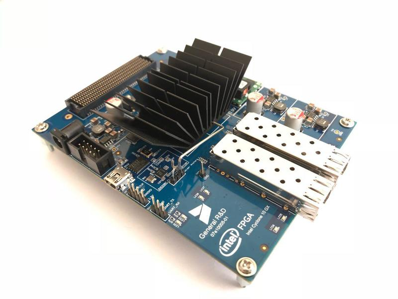

# c10gx

## Schematics and test RTL project for Intel Cyclone 10 GX Development Kit

Kit is intended for evaluation of new Intel’s FPGA family Cyclone 10 GX.

It has FMC connector with many LVDS channels and 2x SFP/SFP+ connectors for 1G/10G Ethernet. FMC connector allows to connect different modules (video, ADC, DAC, etc…). SFP/SFP+ ports support also Direct Attach cables, not only SFP/SFP+ modules.

Project page, board images and contacts - <https://genrnd.com/projects/07e10005/>

### Applications
* Cyclone 10GX family features evaluation
* 1G/10G Ethernet traffic processing
* Real-time processing of video signal
* Real-time DSP processing of analogue signals from one or more ADCs.
* Capturing of information from ADC through 1G/10G Ethernet

### Specifications

#### FMC-interface
* FMC connector for LVDS interfaces: fully compatible with LPC (Low Pin Count) according to VITA57
* Number of LVDS interfaces: 58x LVDS (HPC) + 20 single
* LVDS speed: up to 1.434 Gbps

#### Ethernet
* 2xSFP/SFP+ for 1G/10G Ethernet connection
* Direct Attach support
* Built-in 1G/10G PHY in FPGA chip. PHY power consumption on 10G speed – 168 mW

#### Other interfaces
* JTAG (10-pin) for FPGA debugging
* USB for firmware update
* Firmware update controller: STM32 MCU

#### FPGA
* 10CX150YF672E6G
* Migration chips: 10CX105YF672E6G, 10CX220YF672E6G
* Configuration flash: QSPI 256 Mbit
* Firmware update: JTAG, USB
* Clock sources: 156.25 МГц, 100 МHz

#### Power
* External AC/DC apaters 12 V
* Estimate consumption: less than 8 W

#### Dimensions, Weight
* Length: 130 mm (5.1”)
* Width: 100 mm (4”)
* Weight: ~100 g.
